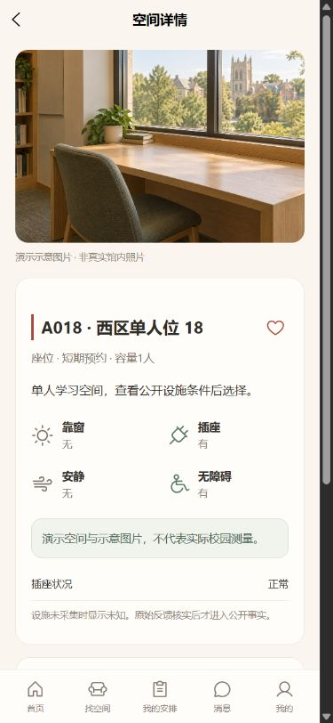

# 期序 · Qixu

**校园空间预约与使用权管理系统**

期序管理有限校园空间在不同时间尺度上的使用权。学生先了解空间，再表达需求；系统依据明确资格、公开分配规则和可解释的处置流程，安排座位、研讨室、教室与活动场地。

> 空间先被理解，再被选择。资格决定参与，分配解决稀缺。使用事实与使用权分离。治理针对明确问题，不评价人的努力。

## 当前状态

本轮自动施工与收尾止于 **M9 工程交付**。M10 前端精修由用户参与，待以后明确重新开启；工程交付资格、视觉精修与微信真机边界分别记录，不以M10延期提前授予M8/M9通过。

2026-10-04：**M0–M8限定范围已验收；M9待交付，M10等待用户参与**。当前可运行代码、阶段限定资格和整个工程交付分别记录：

| 阶段 | 当前事实 |
| --- | --- |
| M0–M7 | 已取得各自限定资格。[M7主线证据](docs/acceptance/m7.md)保留原失败、修复及有限停止线；不宣称零缺陷 |
| M8 | [PR #25](https://github.com/NoctilumeDev/Qixu/pull/25)受保护合入 `4c220626`；该主线 fresh 原生181、前端61及原条件实页/SQL通过，两名独立角色完成新原件对齐。见[M8限定资格](docs/acceptance/m8.md#2026-10-04--主线有限退出) |
| M9 | IN_PROGRESS。[交付合同](docs/contracts/engineering-delivery.md)已冻结，正在准备[两次fresh运行](docs/m9-reproduction.md)、验迹裁决与公开候选；尚未授予资格 |
| M10 | 已按用户要求后置；以后由用户参与并明确开启。最终视觉和微信真机仍为待验边界 |

PM11已在真实开放窗口完成正常身份切换、双方参与/候补及原短约保留复验。原 Core **FAIL / ERROR** 与旧未执行计划均保留；后续通过不覆盖首败。阶段证据见 [M1](docs/acceptance/m1.md)、[M2](docs/acceptance/m2.md)、[M3](docs/acceptance/m3.md)、[M4](docs/acceptance/m4.md)、[M5](docs/acceptance/m5.md)、[M6](docs/acceptance/m6.md)、[M8](docs/acceptance/m8.md)；前端精修归[M10](docs/contracts/frontend-refinement.md)。

以下为固定主线H5运行截图，空间、照片和活动明确标记为演示；不作为真实校园或微信设备证据。

十六条反例与外部经验的实际证明范围见[覆盖复核](docs/coverage-review.md)。[机制账册](docs/m7-coverage-ledger.md)与[未知重入](docs/m7-unknowns.md)区分已验证和未证明；[M8合同](docs/contracts/independent-review.md)保留独立测试和产品复核的有限停止条件。后续只处理阻断发现及原条件复验，不继续穷举同类排列。

| 部分 | 设计方向 |
| --- | --- |
| 学生端 | uni-app 微信小程序；暖米白、朱砂红、空间照片与清晰的楼层图 |
| 管理端 | Vue 3 + TypeScript；桌面优先，同时支持手机审批和现场处置 |
| 后端 | Java 17 + Spring Boot；统一权限、事务与业务状态 |
| 业务事实 | MySQL；预约、分配、使用权、冲突处置分别建模 |
| 集成边界 | 暗室当前身份适配已在固定主线隔离实测；不是SSO，不继承上游角色；青野与教务为后续能力 |

## 产品范围

- 空间档案、设施条件、收藏与对比、透明筛选、楼层平面图。
- 短期预约、到场确认、取消和到期释放；长期席位不实行每日打卡保席。
- 备考批次、资格确认、志愿、冻结输入、可复验分配、确认与固定候补顺序。
- 教室、研讨室与活动场地申请、权限内审批、课程/活动/维护占用及影响处置。
- 老师/管理员组织读书会、公开课、讲座；场地批准后发布，学生预约参加与取消报名。
- 空间反馈、管理员核实、维修事项、复验和空间事实更新。
- 我的申请、使用权、通知、结果解释，以及管理端权限与审计。

第一阶段覆盖图书馆所属空间；领域和接入合同允许其他部门后续加入。身份接入方与活动来源均不拥有期序的空间审批权。

## 从这里开始

| 文档 | 用途 |
| --- | --- |
| [M0](docs/m0.md) | 定位、已定原则、第一版范围与未决细节 |
| [里程碑](docs/milestones.md) | 分阶段施工及退出条件 |
| [长期分配合同](docs/contracts/allocation.md) | 资格、志愿、冻结、随机来源、结果与确认 |
| [候补与退出合同](docs/contracts/waitlist.md) | 补位、退出、期限和批次关闭 |
| [空间申请合同](docs/contracts/venue.md) | 申请、审批、使用与反馈维修 |
| [M2 实施合同](docs/contracts/short-and-venue-implementation.md) | 短约期限、提交恢复、场地及活动事务与验收 |
| [占用冲突合同](docs/contracts/conflicts.md) | 空间层级、冲突、替代安排与恢复 |
| [图书馆活动合同](docs/contracts/events.md) | 一等活动、场地绑定、参与名额及候补/变更 |
| [错题本](docs/failure-notebook.md) | 参考案例、待验证风险和真实失败记录 |
| [测试方法参考](docs/testing-methodology.md) | M7机制攻击、M8独立复验与有限停止线；按业务适配，含期序完成后的三仓待办 |
| [施工记录](docs/decisions.md) | 选择、实际结果、证据与下一步范围 |
| [验迹接入合同](docs/verification.md) | 本工程的封存、真实证据、外部裁决与能力边界 |
| [M1架构](docs/architecture.md) | 身份、权限、事务、模块与工具链 |
| [API](docs/api.md) / [数据模型](docs/data-model.md) | 当前实施范围与后续规划边界 |
| [M5实施合同](docs/contracts/frontend-implementation.md) | 页面、请求恢复、权限投影与限定管理读取 |
| [视觉合同](docs/design.md) | 两端目标、素材和真实页面验收 |
| [生命周期合同](docs/lifecycle.md) | 时间、会话、重试、就绪及前端请求所有权 |
| [可靠性合同](docs/reliability.md) | 断网、未知提交、原键恢复与通知事实 |
| [运行说明](docs/running.md) | 独立 MySQL、明确演示模式和当前后端入口 |
| [外部身份合同](docs/contracts/external-identity-and-recovery.md) | 显式绑定、票据保护、权限及恢复边界 |

## 独立积木

期序拥有空间、规则、分配结果、使用权和处置事实；暗室藏书拥有其账号与图书业务，青野拥有其社团和活动事实。连接通过明确接口完成，不直接修改对方数据库。

本地演示身份用于独立复现，不代表真实校园身份认证。外部身份、活动来源、真实微信平台接入等能力，在实现并实际验证前均不宣称完成。

源码与文档采用 [MIT License](LICENSE)。第三方素材与依赖另行记录来源和许可。
