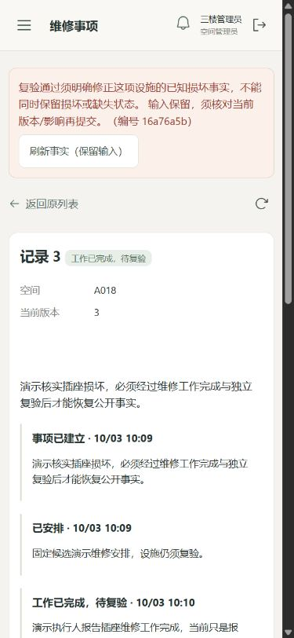

# M5 · 两端页面与请求恢复

状态：CANDIDATE_VERIFIED_NOT_MAIN_QUALIFIED。候选主流程已观察，受保护合入及新主线fresh验证尚未闭合；不得据此宣布M5有效、微信真机或整个项目完成。

## 固定候选与分层证据

[PR#11](https://github.com/NoctilumeDev/Qixu/pull/11)源码候选 `44f1a43cd545f5bab8d3dc243b45730fc6151ce7`。原公开[CI37088154375](https://github.com/NoctilumeDev/Qixu/actions/runs/37088154375)的 Document integrity、Backend · MySQL、Frontend · H5 / WeChat / Admin 均success；主线严格要求这三项，不使用管理员绕过。

- fresh native `m5-324c4441fef446cfb046a0c7ba1cd6d4`：Core PASS，126项真实HTTP/MySQL见证，包括先前不变量、Cookie观察主体、管理范围、原子停止与并发恢复。此次JAR摘要 `26626492d3690aed005e3ce3e4896fc4b439f4721e2dc25df071c94ea78c2cb5`。
- fresh clean frontend `m5-frontend-94482269eeaa4e40911b64395b5aa6b7`：先seal后git archive、npm ci、31项显式可控传输见证、类型检查与H5/微信/admin构建；五项命令exit0，Core PASS。不是浏览器或原生设备证明。
- producer-bound installed `m5-browser-565e2ad8a1de43cba34a717c5bdeeb49`：安装前绑定上述JAR与三份产物摘要，先seal后用真实浏览器操作，17项新DOM/PNG采样，Core PASS。学生及管理手机视口390×844，老师桌面视口981×871。它证明所列页面状态的观察，不单独证明所有业务语义。

全部原Bundle保持原字节，见[索引](../../artifacts/m5/index.json)。[页面观察器](../../scripts/veritrail_browser.py)和[产物服务辅助器](../../scripts/serve_bound_frontend.py)公开供复核；辅助器只监听本机，不是生产部署入口。

## 实际页面及数据库读回

学生地图A018、筛选、档案、收藏与对比、150%地图采样、本人短约历史取消、明确长期候补结果与其他选择、站内未读消息均通过真实API读取。老师已批准场地和活动发布状态可见，学生在固定候选下参加并取消活动2；MySQL最终参与状态CANCELED、顺序1、版本2。老师进入管理员运行入口受到明确拒绝。另一文档换成管理员后，旧老师文档清除投影、停止读写并要求重新加载会话。

在此候选新建反馈3，上传受权限保护的演示JPEG；管理员核实损坏、建立维修3、安排执行人、记录工作完成。WORK_DONE仍待复验。缺明确设施恢复事实的关闭请求正确拒绝：当前维修版本仍3，处理草稿保留，错误自动获得焦点并完整出现在手机视口内。显式加入WORKING后才提交复验关闭；学生详情为RESOLVED，原报告和每个处理事件仍保留。

额外真实页面观察：管理员配置批次2，学生提交B024第一志愿，收到申请3/版本1，随后更新同申请为版本2；页面展示服务器接收时间。验收结束按已公布的未冻结取消规则关闭此演示轮次，保留回执与历史，不运行未来抽签。该额外操作有独立截图，并未冒充17项Core测量中的新断言。

[只读SQL原文](../../artifacts/m5/sql-readback-44f1a43/stdout.bin)对应读回身份 `m5-sql-readback-24da09f4ed00460a9b3840f20dbfc3d0`、exit0、摘要 `1477867da053d7a2baae52a23c8fd32ce534051ebb20000aeda37381618dcae2`：维修3 VERIFIED_CLOSED/v4，反馈3 RESOLVED/v4；A018的 `profile_json.conditions.outletCondition=WORKING`；JPEG1200×800、167875字节；批次2 CANCELED且正式结果0，申请3唯一且两个不可变版本；反馈通知6/6、批次通知3/3已投递。此只读脚本本身是施工读回，不独立授予阶段资格，需与固定产物和页面动作一起评估。

## 首次失败与最小修复

- `m5-browser-3fe31f03dadf45739f48ba448c518071`原Core FAIL：两个测量词与实际文案不一致。原Plan/截图/Bundle保留；独立封存的固定字节重测 `m5-browser-remeasure-a55953076fd24982b9f90f3756521a1b` PASS，只纠正文案测量，不声称重新执行页面。
- 检视上述首批真实截图发现产品缺陷：维修拒绝时错误位于页面顶部，而用户仍在手机表单底部。DOM存在错误不等于用户看得见。先保存首败，再在管理表单加焦点及居中滚动、学生表单显式错误滚动；新44f1a43产物重新执行受影响链，错误可见/焦点两项断言均成立。
- 第一版私有产物服务辅助器在Handler初始化前访问server而导致空响应，属于安装观察接线故障。只修辅助器并核实自有进程归属，不改变业务裁决；原失败日志本地保留，公开的是修正后的可审阅辅助器。
- 一次地图采样误操作为200%，原采样保存在 `first-map-capture-200`，再实际操作到合同150%取得新的指定采样；不修改截图或封存断言。

更早施工首败、夹具及请求恢复修订见[错题本](../failure-notebook.md)。本文件新增提交不将44f1a43的证据换绑为自己的新安装资格。

## 保留边界与下一门禁

未经实际微信认证/上传/合法域名、iOS/Android设备观察，不宣称真机PASS。H5与微信包构建分别记录；照片和楼层坐标明确演示，不能声称真实场馆测量或现实维修。最终视觉、细节文案与键盘精修仍归M10；已知影响使用和事实的缺陷不能因此豁免。

M6接入及恢复、M7有限强攻击、M8独立测试/产品、M9工程候选和M10均未完成。M7按失败机制与可追踪未知收束，126/31/17这些数量不作为其停止依据。当前先完成PR最新检查、普通受保护合入、新exact-main fresh原生/构建/安装读回及远端对齐，再发布M5限定资格。
