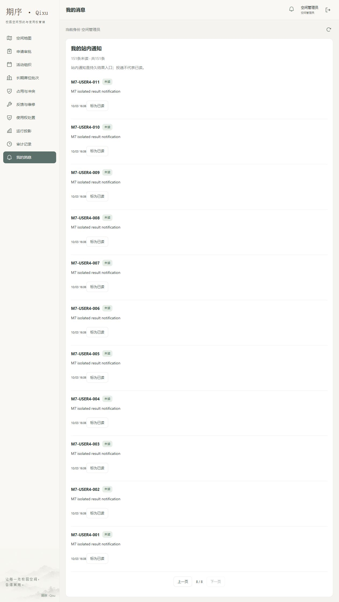
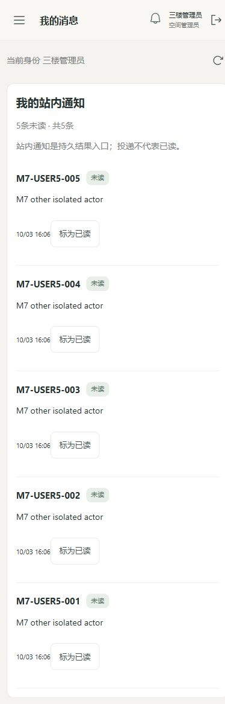

# M7 · 真实页面组合观察

当前为施工候选，M7整体尚未退出；不是主线或微信真机资格。原包字节见[索引](../../artifacts/m7/index.json)。

## 首次产品失败

固定源`7619d8f3fc001950b0909a1b2f806913fd034365`，先封存browser0.2/Plan2，再安装同源native173、frontend45的实际JAR和静态产物。隔离MySQL6980/API6981/学生6982/管理6983；初始化迁移、站内消息原始SQL及唯一收藏/回执独立核对。

[原Core FAIL](../../artifacts/m7/m7-browser-a30741a1f205491f937528762a22f102/acceptance-report.md)为COMPLETED、14份实际DOM/JPEG齐备。只有七条管理端分页/未读断言失败：管理端显示151项却只获取默认100条，无分页、无独立未读数，最旧001不可达；标为已读后仍无第8页。原始失败为PRODUCT_PROJECTION_INCOMPLETE，不能以后台SQL正确或构建通过替代。

同次学生第8页最旧001可见，已读后页码保持且151→150；收藏后端已200但代理丢回应，页面保留UNKNOWN、重载保留原键、查回执恢复且SQL仅一个收藏/回执；两管理文档换号后旧页停止，重载核对新主体；学生换号仅见自己的5条；地图安静筛选返回保留。最终SQL两主体各151/150、另外两主体各5/5；全部owned子进程、线程及四端口清理成立。这些只支持声明的代表性trace。

390px观察使用实际选中的管理文档。早先对另一文档设置尺寸的误选截图单独保留私有，不代替手机截图；最终`window.innerWidth=390`、文档clientWidth/scrollWidth均375（15px竖滚动条），无文档横向溢出。不要把document.clientWidth误写成浏览器视口尺寸。

## 最小修复与复验入口

修复前冻结合同1.2：管理消息页显式请求20条，独立显示未读/总量；路由保留页码，已读后重查同页；加载/错误不显示虚假零或空列表完成。保持原14捕获、SQL、隐私、UNKNOWN、当前主体和清理断言。

新干净修复源依次运行fresh native0.19、frontend0.4，`veritrail_m7_browser.py seal <native> <frontend>`，再启动owned fixture、通过CUA重复原UI动作、stop、finalize。不得覆写当前FAIL或继承旧源的构建资格。

尚未观察原生微信键盘、浏览器真实存储拒绝/配额、晚Set-Cookie调度与所有设备。相应入口仍是M7未知账册/F08/F09及M10设备合同；这次正常H5不将它们升级为已证明。

## 固定修复候选原条件复验

`6ae43a4ff112b6984fa17f68d1fab6133580e9d6`的新[native173](../../artifacts/m7/m7-a3a62b4fc3224eb8b68b60212802353e/acceptance-report.md)、[frontend45及三个构建](../../artifacts/m7/m7-frontend-166c3c0255244fa7a19f8dd48990f570/acceptance-report.md)、[原14实际页面PASS](../../artifacts/m7/m7-browser-7559f46d192f47cf8f34ebbc0c26feda/acceptance-report.md)各为新身份。管理消息显式20条，第一页151/151、第8页最旧001、读后150并保留第8页。原其他11状态、SQL唯一性、当前主体、390px无文档横溢和owned清理均成立。采集器、fixture、14断言不变；不继承旧提交产物。

原条件动作中的登录过渡截图私有追加保留；等实际身份加载完成后才进入地图并保存最终状态，不把登录标签上的名字替代授权地图。早先误用无Core环境的Python在import阶段退出、未启动夹具；正确入口必须是已安装Core的虚拟环境，原工具错误不算产品失败。

下图为同一候选的实际第8页与390px页面，仅演示数据，精修仍归M10。

